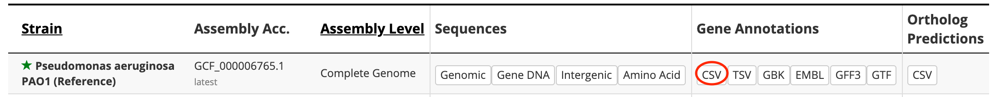
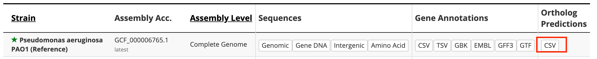

This directory includes data files that are used to populate the database
during deployment.

TODO:
- [x] Get the mouse gene_info file
- [x] Get the mouse gene history file
- [x] Download a gene annotations file for mice
- [x] Update create_updated_genes to be compatible with above_gene_annotations.tsv
- [x] Figure out how to load model into database
- [x] Build model yml file
- [x] Document above
- [x] Figure out what experiment_Sample_annotation is and rebuild it (Seems to be generated from a variety of metadata; maybe we can sidestep the generation process and just use the metadata from mousiplier?)
- [x] Document above
- [x] Build gene_gene_network via correlation between gene's weights in different LVs
- [x] Document above
- [x] Build gene signature participation (reformat PLIER Z matrix)
- [x] Document above
- [x] Build sample signature activity (transform training data with PLIER weights)
- [x] Document above
- [x] Update populate_database.sh
- [ ] Test database population
- [ ] Figure out what crossref database does
- [ ] Update datafiles and README to remove adage-specific info


1. **Mus_musculus.gene_info**: Mouse gene information

   This file is decompressed from **raw/Mus_musculus.gene_info.gz**, which is downloaded from:
   `ftp.ncbi.nih.gov/gene/DATA/GENE_INFO/Mammalia/Mus_musculus.gene_info.gz`

2. **gene_history_10090**: gene history file of Mus musculus

   This file is generated based on the following procedure:
   ```shell
   wget ftp://ftp.ncbi.nih.gov/gene/DATA/gene_history.gz                                                                                                                                                    
   gunzip -k gene_history.gz                                                                                                                                                                                
   (head -1 gene_history; grep  $'^10090\t' gene_history) > gene_history_10090
   ```
   The original downloaded file **gene_history.gz** is saved in **raw** subdirectory as
   a referenece.

3. **updated_genes.tsv**: maps a gene's PAO1 name to its standard name and aliases.

   This file is the output of the following commands:
   ```shell
   cd raw/; python3 create_updated_genes.py
   ```

4. **Pseudomonas_aeruginosa_genesets.json**: public genesets of pseudomonas

   This JSON file should be converted to Python pickle format by `deployment/create_pickled_genesets.py`.
   The pickle file is required by the endpoint of
   `/api/v1/tribe_client/return_unpickled_genesets?organism=Pseudomonas+aeruginosa`

5. **mousiplier_gene_signature_participation.tsv**: A mapping between genes and latent variables (referred to in Adage as signatures).

   This TSV is created by running the `process_raw_data` script.

5. **mousiplier_sample_signature_activity.tsv**: A mapping between samples and their corresponding latent variable values

   This TSV is created by using the `process_raw_data` script to transform the training data from mousiplier into the learned latent space.

5. **mousiplier_gene_gene_network_cutoff_0.2.txt**: A list of correlations between genes

   This file is generated in `process_raw_data` by loading the gene signature participation data, calculatinge the pearson correlation between the genes, and removing all correlations with absolute values less than 0.2.
5. **mousiplier_mousiplier_ml_model.yml**: A model listing information about the mousiplier model

   This file was built by hand based on the similar model files from Adage.
5. **recount_metadata.tsv.gz**: A TSV containing sample and experiment metadata

   This file is downloaded from Recount3 as part of the mousiplier pipeline, then GZipped and stored here

5. **raw/Pseudomonas_aeruginosa_PAO1_107.csv**: Pseudomonas gene annotations file

   This file was decompressed from
http://pseudomonas.com/downloads/pseudomonas/pgd_r_19_1/Pseudomonas_aeruginosa_UCBPP-PA14_109/Pseudomonas_aeruginosa_UCBPP-PA14_109.csv.gz, with line `4628` commented out:
   ```
   19.1,GCF_000006765.1,chromosome,NC_002516.2,PGD111894,PA4527,pseudo,5071567,5072691,+,still frameshift type 4 fimbrial biogenesis protein PilC (putative pseudogene),,,,,,1125,,,,
   ```
   because the gene `PA4527` is already available on line `4627`.

   The download URL is copied from
   [Pseudomonas Downlaod Page](http://pseudomonas.com/strain/download).
   See the red link on the following screenshot:
   <div align="center">
       
   </div>

   This file is used to map a gene's PAO1 name to its standard name and aliases (if any).

6. **raw/Pseudomonas_aeruginosa_PAO1_107_orthologs.csv**: Pseudomonas ortholog predictions file

   This file is decompressed from:
   http://pseudomonas.com/downloads/pseudomonas/pgd_r_19_1/Pseudomonas_aeruginosa_PAO1_107/Pseudomonas_aeruginosa_PAO1_107_orthologs.csv.gz

   The download URL is copied from
   [Pseudomonas Downlaod Page](http://pseudomonas.com/strain/download).
   See the red link on the following screenshot:
   <div align="center">
       
   </div>

   This file is used to map a gene's PAO1 name to its PA14 name.

7. **raw/gene_name_alias_corrections.tsv**: a TSV file with gene gene names/alaises corrections

   This file was generated by Dongbo Hu, Georgia Doing and Deb Hogan.

8. **raw/create_updated_genes.py**: a script that reads files **4**, **5**, **6**, and
prints out the updated gene names and aliases.

   The output is used as the input of the management command
   `genes/management/commands/update_gene_names_aliases.py`.

9. **raw/filtered_Z.tsv**: A TSV file mapping genes to PLIER latent variables

   This file is produced by running the mousiplier pipeline

9. **raw/sample_to_lv.pkl**: A TSV file mapping genes to PLIER latent variables

   This file is an intermediate output produced by running process_raw_data. 
   It contains the LV-space representation of all the samples in the mousiplier training data, and is included in the place of the full `no_scrna_rpkm.tsv` file,
   which takes up 40GB.

9. **raw/mouse_gene_annotations.tsv**: A tsv file containing information about mouse genes' synonyms

   This file was downloaded from http://www.informatics.jax.org/downloads/reports/MRK_List1.rpt

